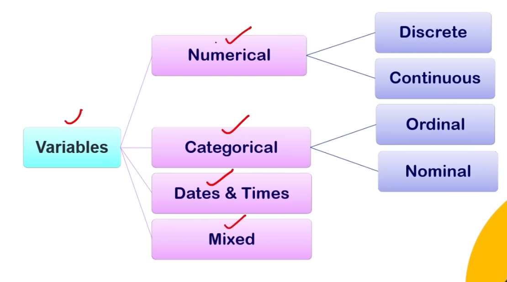
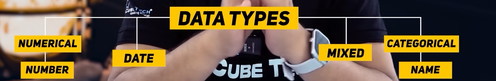
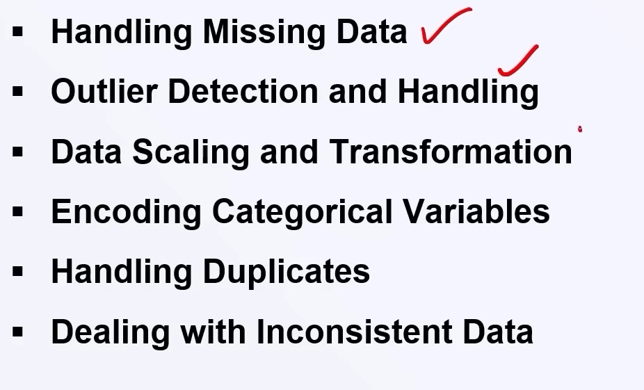
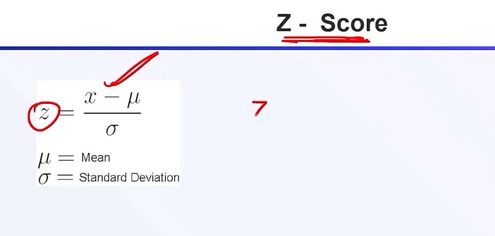
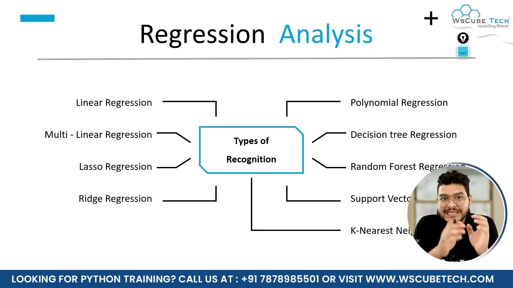

#ReadMe

30:04 
Types of data 

Data cleaning
 
 Required data in the numerical form

 

We use sklearn.impute to fill missing values.
It's basically use when we're on the final stage of our application and building pipelines.

"One-Hot Encoding (OHE)"
        One-hot encoding is a technique used to convert categorical data into a numerical format that machine learning models can process. It represents each category as a binary vector.

"Label Encoding"
        Label Encoding is a technique used to convert categorical data (text labels) into numerical values. Each unique category is assigned an integer value.

Ordinal Encoding is best when the categorical values have a meaningful order.
"When to Use Ordinal Encoding?"
    ✅ Ordered Categories (Ordinal Data)

        Education Levels: Primary < Secondary < Graduate < Postgraduate
        Customer Satisfaction: Bad < Average < Good < Excellent
        Rankings: Bronze < Silver < Gold < Platinum

    🚫 Not for Unordered Categories (Nominal Data)

    Colors: Red, Blue, Green (No natural order) → Use One-Hot Encoding instead.

"Outliers in ML"
        An outlier is a data point that significantly differs from the rest of the dataset. It is an unusual value that deviates from the expected pattern of data. Outliers can arise due to measurement errors, data corruption, or rare events.

Using the Z-score (Standard Deviation Method)
    Z-score measures how many standard deviations a data point is from the mean. Data points with a Z-score beyond a threshold (commonly ±3) are considered outliers.

Backward and forward elimination are two feature selection techniques used in machine learning and statistical modeling to optimize models by selecting the most relevant features. These methods are commonly used in regression models to improve performance and reduce overfitting.

1. Forward Elimination
Definition:
Forward elimination is a stepwise regression technique where we start with an empty model (no features) and progressively add features that significantly improve the model's performance.

Steps:

Start with no predictors (only the intercept).
Compute the model's performance (e.g., p-value, adjusted R², AIC, BIC).
Add the feature that has the most significant contribution (lowest p-value or highest R² improvement).
Repeat step 3 until adding a new feature does not improve the model significantly.
Pros:
✅ Simple and computationally efficient.
✅ Ensures only significant features are included.

Cons:
❌ Might miss important feature interactions.
❌ Results can be biased if the best features depend on earlier selections.

2. Backward Elimination
Definition:
Backward elimination starts with all features and systematically removes the least significant ones until the model reaches optimal performance.

Steps:

Start with all available features.
Fit the model and compute significance (p-value for regression, feature importance for ML models).
Remove the feature with the highest p-value (least significant).
Recompute the model and repeat step 3 until all remaining features are significant.
Pros:
✅ Considers all features initially, avoiding missing important ones.
✅ More reliable when feature interactions matter.

Cons:
❌ Computationally expensive, especially with large datasets.
❌ May remove some features that are useful when combined with others.

In machine learning, we divide a dataset into two parts:

Training Set – Used to train the model (typically 70-80% of the data).
Test Set – Used to evaluate the model’s performance (typically 20-30% of the data).
This ensures that the model learns patterns from the training set and generalizes well to unseen data in the test set.

📌 Regression Analysis in Machine Learning
Regression analysis is a statistical method used in machine learning to find the relationship between independent variables (features) and a dependent variable (target/output). The goal is to predict continuous values, such as house prices, stock prices, or sales revenue.

📌 Simple Linear Regression in Python
Simple Linear Regression is used to predict a continuous dependent variable (y) based on one independent variable (X). It fits a straight line (y = mx + c) to the data.

Multiple Linear Regression in Machine Learning
Multiple Linear Regression (MLR) is an extension of Simple Linear Regression where multiple independent variables (predictors) are used to predict a dependent variable. It is a fundamental supervised learning algorithm in machine learning and statistics.
